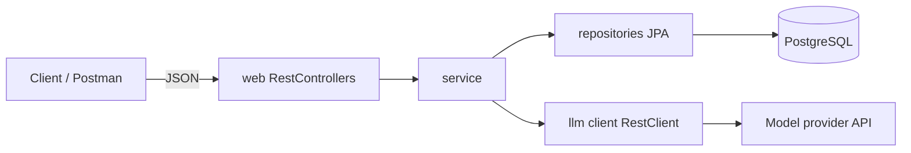

# Putting it together: final project architecture (REST + JPA + LLM)

**Introduction**

By the end of this **series** you have **one** **deployable** app: a **CRUD** API for a domain (e.g. `Item`) plus a **Chat** feature that **reads** and **writes** **PostgreSQL** and **calls** a **remote** model. This post **names** the **layers** and the **one**-**way** **dependencies** so the codebase stays **maintainable** when the team grows.

**Real-world explanation**

- **Inward** **dependencies** — *Web* → *Application (service)* → *Domain + ports*; *infrastructure* (JPA, HTTP to LLM) **implements** **ports** at the **outer** **edge** of **hexagonal** **thinking** (you do not need a **formal** **hex** **folder** **tree** to **get** the **idea**)
- **Single** **Spring Boot** **JVM** in this **article**; **async** **workers** and **separate** read models are **optional** **later** **moves**
- **Trust** **boundary** at **HTTP** in + **out** to the **LLM** — **no** **secrets** in **git**, **redact** logs

**Mermaid: request paths**



**Responsibility checklist**

| Layer        | Does | Does not |
|-------------|------|----------|
| `web`       | HTTP mapping, validation on DTOs, status codes, auth hooks later | SQL, external HTTP to LLM |
| `service`  | Use cases, one transaction for “save user msg → call model → save reply” (when you wire it) | Raw `HttpServletRequest` or JDBC |
| `repository` | JPA + queries | Business rules about “what reply means” |
| `model` / domain | Entities, invariants in methods if you use rich domain | Annotations for JSON only in DTOs, not in entities in strict style (teams vary) |
| `config`   | `DataSource`, `LlmProperties`, CORS, security, RestClient customizers | business logic |
| `dto`      | Request/response and error **JSON** shapes | persistence |

**Folder structure (suggested for this series)**

```text
src/main/java/com/example/demoservice/
  DemoServiceApplication.java
  config/           # CORS, LlmProperties, @EnableConfigurationProperties
  dto/              # Item*, Chat*, ErrorResponse, PageResponse
  model/            # Item, ChatSession, ChatMessage
  repository/      # *Repository
  service/         # ItemService, ChatService, Transcript+LLM orchestration
  web/              # *Controller, RestExceptionHandler
  client/          # (optional) thin wrapper if RestClient is not in @Service
src/main/resources/
  application.yml
  application-prod.yml
  db/migration/    # if Flyway (recommended for prod)
```

**Common mistakes**

- **Controller** that **opens** **EntityManager** or **raw** **RestClient** — it **buries** the **use** case and **breaks** **tests**
- **Services** that **return** **entities** **directly** to the **client** (avoid when DTOs exist)
- **Circular** **dependency** A→B→A: **split** a **smaller** service or use **an** **event** **(optional)**

**Best practices**

- **Integration** test **one** **slice** (e.g. `ItemController` + H2) and **separately** **mock** **the** **LLM** in **Chat** **tests** so **CI** is **fast** and **deterministic**
- **Version** the **public** **REST** **under** `/api/v1/...` when the **app** is **exposed** **to** **external** **partners** (optional for internal-only)

**Final summary**

**One** app, **clear** **package** **names**, **inward** **pointing** **arrows** on **the** **dependency** **graph**. Next: **pack** the **JVM** and **Postgres** into **Docker** so the **same** **shapes** run on **any** **machine** your **team** uses for **rehearsal** and **onboarding**.
