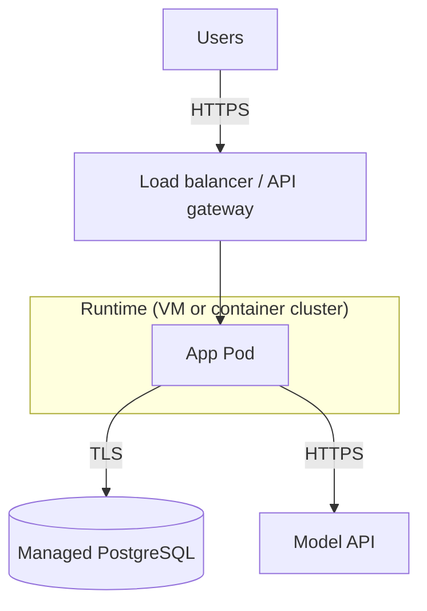

# Deployment basics: from JAR to a running service people can trust

**Introduction**

**Deploying** is **putting** a **known** **build** **(artifact** **+** **config** **+** **migrations**)** in** **a** **runtime** with **a** **URL** **or** **VPC** **endpoint** and **operating** it. For **this** **series** the **unit** of **deploy** is a **container** or **JVM** **+** a **managed** or **self**-**hosted** **Postgres** **instance**. This **last** post **stays** **vendor**-**neutral** and **lists** **checklists** **and** **terms** you will **see** on the **job** **(staging**, **rollout**, **probes**).

**Real-world explanation**

- **Dev / staging / prod** — different **databases**, **keys**, **log** **levels**; same **code**; **config** and **migrations** **differ** (we used **Spring** **profiles** and **env** **in** chapter **21**)
- **Artifact** — the **fat** JAR (or the **image** that **wraps** it) **is** what **the** **pipeline** **keeps** **as** a **versioned** **thing**; **rebuilds** of **old** **tags** should be **reproducible** from **git** at **a** **tag** **or** **commit**
- **Database** **migrations** **before** or **with** **app** **start** — for **serious** **work**, **Flyway** or **Liquibase** **runs** in **a** **controlled** **step** (e.g. **K8s** **Job**, **init** **container**), not **`ddl-auto=update`** in **prod**
- **LLM** **key** in **a** **secret** **store**; **the** app **read**-**only** **receives** it as **an** **env** **var**; **no** key **in** **the** **image** **or** **git**

**Pre-deploy checklist (minimum)**

- **Migrations** applied to **target** **schema** (in **staging** **first** on a **copy** of **anonymized** **data** if you have it)
- **Config** for **JDBC** **URL** **(SSL** to **DB** in **cloud** if **required**), `SPRING_PROFILES_ACTIVE=prod`
- **Resource** **limits** **(CPU,** **memory,** **concurrency** of **HTTP** and **JDBC** **pool**)** so** a **spike** **does** **not** **kill** the **node**
- **Log** **redaction** rules; **PII** **in** **prompts** **governed** by **policy** if you log **bodies** at **all**
- **Rollback** **plan** — **older** **image** **+** **migration** **down** **(only** if the **tool** **supports** **reversible** **migrations**; **some** **teams** **only** **forward**-**only** with **a** **fix** **migration**)

**Post-deploy verification**

- **`/actuator/health`** (if **Spring** **Actuator** **on** the **classpath** and **exposed** on **a** **safe** **port** or **path**): **liveness** **(process** up)** and **readiness** (can **open** **DB** — **add** a **DB** check **in** **readiness** in **serious** **setups**)
- **One** **smoke** call: **GET** a **read**-**only** **endpoint** or **POST** with **a** **test** **key** in **a** **non**-**prod** **env**
- **Error** **rate** and **latency** in **the** **APM** (even **basic** **provider** **dashboards** count) **right** after **the** **switch**

**Mermaid: abstract hosting**

**Common mistakes**

- **Running** `ddl-auto=update` in **prod** and **hoping** **Hibernate** **invents** a **sane** **migration** **at** **scale** **with** **concurrent** **replicas** — **it** does **not** for **nontrivial** **changes**
- **Same** **Postgres** **as** both **dev** and **prod** (accidental **wipe** or **schema** **mismatch**)
- **No** **readiness** check so **the** **LB** **sends** **traffic** **to** a **JVM** **before** the **datasource** **pools** **is** **ready** — **short** **5xx** **burst** on **rollout**
- **Logging** the **LLM** **key** in **a** **debug** line **in** the **advice** **(never)**

**Best practices (carry forward)**

- **Immutable** **deploys**: **one** **image** **or** **one** **JAR** **per** **release** **id**; **config** at **start**; **no** hand **edits** on **the** **server** **(except** break-glass, **with** an **audit** trail**)
- **Backups** and **restore** **test** of **Postgres** **on** a **schedule**; **RPO**/**RTO** are **product** **decisions**—**at** **least** **write** them **down** once
- **Observability**: request **id** in **MCD**, **structured** **JSON** logs, **alerts** on **error** **spike** **and** **latency** **P99**

**Final summary**

**Deployment** is not **a** **single** **script**; it is **a** **repeatable** path from a **tested** **artifact** plus **migrations**, **secrets**, and **smoke** **checks** to a **running** version you can **watch** in **logs** and **roll** **back** when you must. The rest of a career in backend work is **hardening**: **auth**, **Spring** **Security**, **Flyway**-style **migrations**, and **K8s**-style **orchestration** are natural **next** **learning** **tracks** once this **end-to-end** slice feels **comfortable**.
